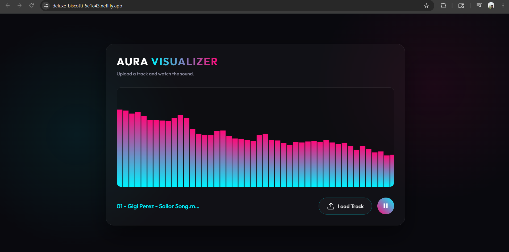

# 🎧 Aura | Interactive Web Audio Visualizer


A client-side immersive audio visualizer built to demonstrate advanced DOM manipulation, native browser APIs, and high-performance UI rendering. 

🚀 **[Live Demo on Netlify][(https://deluxe-biscotti-5e1e43.netlify.app/)]** 

---

## 📸 Preview

*(Replace the link below with the actual path to your screenshot after taking one)*



---

## 💻 Project Overview

Aura allows users to upload local `.mp3` files securely within the browser (no server-side uploads required) and generates real-time, 60-FPS audio frequency visualizations. It features a modern, Gen-Z aesthetic using Glassmorphism UI principles, glowing gradients, and responsive layouts.

## ✨ Technical Features

* **Web Audio API Integration:** Utilized `AudioContext` and `AnalyserNode` to intercept audio streams and extract `ByteFrequencyData` in real-time.
* **Hardware Accelerated Rendering:** Used the HTML5 `<canvas>` API synced with `requestAnimationFrame` to ensure a smooth, jank-free 60 FPS visual rendering loop.
* **Security & Performance:** Utilized `URL.createObjectURL()` to play local audio files directly from the user's disk without making network requests or storing user data.
* **Modern CSS Architecture:** Built using CSS Custom Properties (variables) for theme management and `backdrop-filter` for complex frosted-glass effects.

## 🧠 What I Learned

Building this project without relying on external libraries (like React or Three.js) challenged me to deeply understand:
1. **The Browser Event Loop:** Managing `requestAnimationFrame` alongside audio play/pause states to prevent memory leaks.
2. **Audio Routing:** Learning how to connect Media Element Sources to Analysers and then to the hardware destination.
3. **Data Mapping:** Taking arbitrary arrays of numbers (frequency decibels from 0 to 255) and mapping them cleanly to dynamic visual coordinates on a resizable canvas.

## 🛠️ How to Run Locally

1. Clone the repository: 
```bash
   git clone [https://github.com/Sanjayreddi/Audio-Visualizer]
